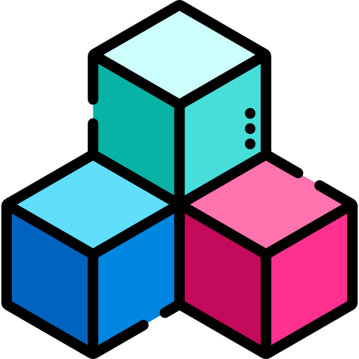
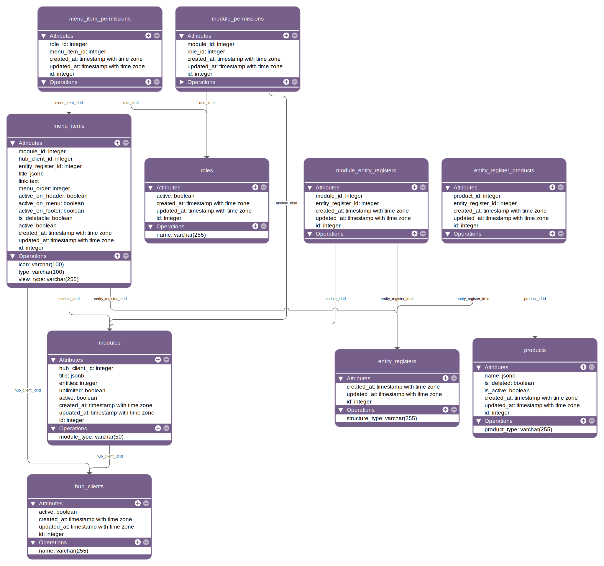

<table style="width:100%" align="center" border="0">
  <tr align="center">
    <td></td>
    <td><h1>🧩 Go Modules API 📦</h1></td>
  </tr>
</table>

<p align="center">
  <strong>An open-source API to manage hub client modules built with Go.</strong>
</p>

<p align="center">
  
  
  
  
  
  <a href="https://github.com/gabrielmaialva33/go-modules-api/commits/master">
    
      
  </a>
</p>

<br>

<p align="center">
  <a href="#bookmark-about">About</a>&nbsp;&nbsp;&nbsp;|&nbsp;&nbsp;&nbsp;
  <a href="#computer-technologies">Technologies</a>&nbsp;&nbsp;&nbsp;|&nbsp;&nbsp;&nbsp;
  <a href="#wrench-tools">Tools</a>&nbsp;&nbsp;&nbsp;|&nbsp;&nbsp;&nbsp;
  <a href="#package-installation">Installation</a>&nbsp;&nbsp;&nbsp;|&nbsp;&nbsp;&nbsp;
  <a href="#memo-license">License</a>
</p>

<br>

## :bookmark: About

**GO MODULES API** is a REST API built with **Go**, using **Fiber** as the web framework and **GORM** for database
interactions.  
It provides a modular structure to manage **hub clients**, **modules**, **roles**, and **permissions** efficiently.

<br>

## :computer: Technologies

- **[Go](https://go.dev/)**
- **[Fiber](https://gofiber.io/)**
- **[GORM](https://gorm.io/)**
- **[PostgreSQL](https://www.postgresql.org/)**
- **[Docker](https://www.docker.com/)**
- **[Cobra](https://github.com/spf13/cobra)** (CLI management)
- **[Zap](https://github.com/uber-go/zap)** (Logging)
- **[OpenAPI](https://swagger.io/specification/)** (API documentation)

<br>

## :chart_with_upwards_trend: Database Diagram

<p align="center">
  
</p>

<br>

## :wrench: Tools

- **[VSCode](https://code.visualstudio.com/)**
- **[GoLand](https://www.jetbrains.com/go/)**

<br>

## :package: Installation

### :gear: **Prerequisites**

Ensure you have the following installed:

- **[Go](https://go.dev/dl/)**
- **[Git](https://git-scm.com/)**
- **[Docker](https://www.docker.com/)**
- **[Docker Compose](https://docs.docker.com/compose/)**

<br>

### :octocat: **Cloning the repository**

```sh
git clone https://github.com/gabrielmaialva33/go-modules-api.git
cd go-modules-api
```

<br>

### :whale: **Running the application with Docker**

```sh
docker-compose up --build
```

The application will be available at `http://localhost:3000`.

<br>

### :computer: **Running the application locally**

```sh
# Copy the .env.example file to .env
cp .env.example .env

# Install dependencies
go mod tidy

# Start the application
go run main.go
```

The application will be available at `http://localhost:3000`.

<br>

## :rocket: **API Documentation**

After running the application, the API documentation (redoc) will be available at:

- 📌 Redoc UI: `http://localhost:3000/docs`
- 📌 OpenAPI File: `http://localhost:3000/openapi.yaml`

<br>

## :memo: License

This project is under the **MIT** license. [MIT](./LICENSE) ❤️

<br>

## :rocket: **Contributors**

| [](https://github.com/gabrielmaialva33) |
|-----------------------------------------------------------------------------------------------------------|
| [Maia](https://github.com/gabrielmaialva33)                                                               |

Made with ❤️ by Maia 👋🏽 [Get in touch!](https://t.me/mrootx)

## :star:

Liked? Leave a little star to help the project ⭐

<br/>
<br/>

<p align="center"></p>
<p align="center">&copy; 2017-present <a href="https://github.com/gabrielmaialva33/" target="_blank">Maia</a>


